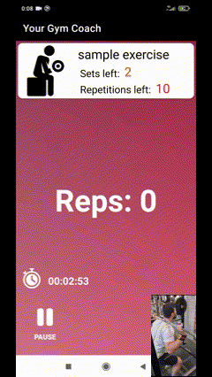

# Smart Fitness Bracelet and Exercise Repetition Counter
This course project is an Arduino-based wrist bracelet that tracks your progress during training. It supports various exercises, including running and walking (step counter), squats, abdominal workouts, jumps, weight exercises, and other gym routines.

  

Bracelet code part was written in C for Arduino, the app was developed using Android Studio (Java), the step/repetition counter model was developed using Python.

[App demonstration](https://youtu.be/A_tE-qQRoek)
